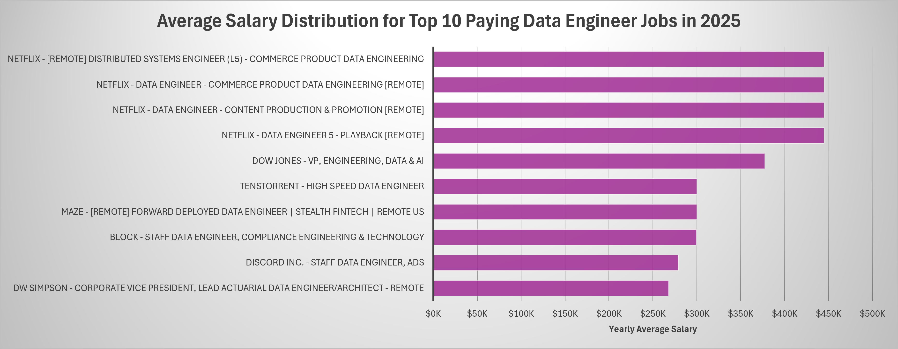
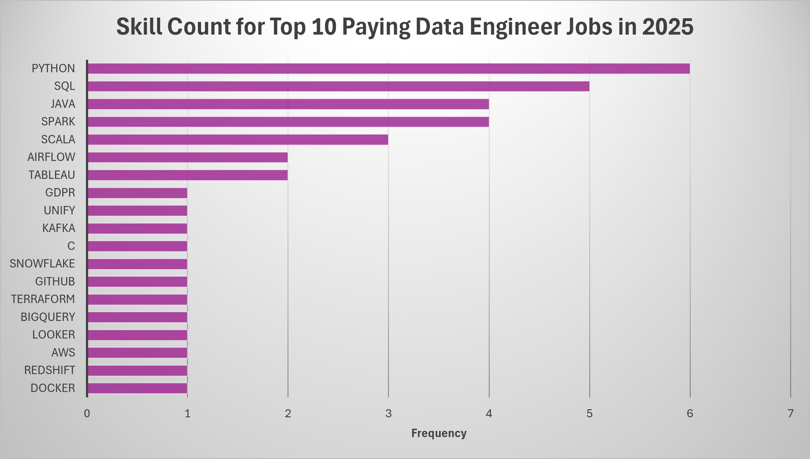

# 🖊️Introduction
Exploring the data engineering job market 
👉 uncovering high-paying opportunities, in-demand skills, and the intersection of strong demand and competitive salaries.

# 📰Background
Motivated by a desire to better understand the data engineer job market, this project was created to identify the most in-demand and highest-paying skills, helping job seekers focus on opportunities with the greatest potential.

The data for this project comes from [Luke Barousse's SQL for Data Analytics](https://www.lukebarousse.com/sql), which includes valuable insights into job titles, salaries, locations, and key technical skills.

### The questions I wanted to answer through my SQL queries were:    

1. What are the top-paying data engineer jobs?  
2. What skills are required for these top-paying jobs?  
3. What are the most optimal skills to learn?  

# 🧰Tools I Used
For this deep dive into the data engineer job market, I utilized several essential tools:  

**SQL:** Used to query and analyze the dataset, uncovering valuable insights from the job market data.  
**PostgreSQL:** Served as the database management system for storing and managing the job posting data.  
**Visual Studio Code:** Used for writing, managing, and executing SQL queries efficiently.  
**Git & GitHub:** Enabled version control, project tracking, and sharing of SQL scripts and analysis.

# 📊The Analysis
Each query targets a specific angle of the data engineer job market. Here's the thinking behind them:  

### 1. Top Paying Data Engineer Jobs  
To surface the highest-paying roles, I filtered data engineer positions by average yearly salary, narrowing the results to remote opportunities. This highlights where the real earning potential sits in the field.

```sql
SELECT
    jpf.job_id,
    jpf.job_title,
    jpf.job_location,
    jpf.job_schedule_type,
    jpf.salary_year_avg,
    jpf.job_posted_date,
    cd.name AS company_name
FROM 
    job_postings_fact jpf
LEFT JOIN company_dim cd ON jpf.company_id = cd.company_id
WHERE 
    jpf.salary_year_avg IS NOT NULL AND 
    jpf.job_title_short = 'Data Engineer' AND 
    jpf.job_work_from_home = TRUE AND
    jpf.job_posted_date BETWEEN '2025-01-01' AND '2025-12-31'
ORDER BY 
    jpf.salary_year_avg DESC
LIMIT 10;
```
**Top-Paying Data Engineering Jobs in 2025 - Key Insights**  

• **Netflix dominates the top tier.** Four of the ten highest-paying roles are at Netflix, all offering $445,000/year - the highest salary in the dataset. These span specialized teams including Commerce Product Data Engineering, Content Production & Promotion, and Playback.

• **The salary ceiling is $445K, with a meaningful drop-off below.** The top four roles cluster tightly at $445K (Netflix), then salaries fall sharply to the next tier - Dow Jones' VP of Engineering at $377,500 and Tenstorrent/Maze roles at $300K - suggesting Netflix is an outlier even among elite payers.

• **Diverse industries are represented.** Beyond tech (Netflix, Discord, Block), the list includes fintech (Maze, Dow Jones), insurance/actuarial (DW Simpson), and hardware (Tenstorrent) - indicating that top data engineering talent commands premium salaries across sectors.

• **Staff- and VP-level titles reflect seniority expectations.** Roles like "Staff Data Engineer," "VP of Engineering," and "Level 5 Engineer" confirm these salaries correspond to senior individual contributors and executives, not mid-level positions.



### 2. Skills for Top Paying Jobs  
To understand what skills are required for the top-paying jobs, I joined the job postings with the skills data, providing insights into what employers value for high-compensation roles.

```sql
WITH top_paying_jobs AS (
    SELECT
        jpf.job_id,
        jpf.job_title,
        jpf.salary_year_avg,
        cd.name AS company_name
    FROM 
        job_postings_fact jpf
    LEFT JOIN company_dim cd ON jpf.company_id = cd.company_id
    WHERE 
        jpf.salary_year_avg IS NOT NULL AND 
        jpf.job_title_short = 'Data Engineer' AND 
        jpf.job_work_from_home = TRUE AND
        jpf.job_posted_date BETWEEN '2025-01-01' AND '2025-12-31'
    ORDER BY 
        jpf.salary_year_avg DESC
    LIMIT 10
)
SELECT 
    tpj.job_id,
    tpj.job_title,
    tpj.salary_year_avg,
    tpj.company_name,
    sd.skills
FROM 
    top_paying_jobs AS tpj
JOIN skills_job_dim AS sjd ON tpj.job_id = sjd.job_id
JOIN skills_dim AS sd ON sjd.skill_id = sd.skill_id
ORDER BY tpj.salary_year_avg DESC;
```
**Skills Required for the Top-Paying Data Engineer Jobs in 2025 - Key Insights**

• **Python and SQL dominate the highest-paying Data Engineer roles,** appearing in 6 and 5 of the top 10 jobs respectively, making them the most consistently requested technical skills across elite compensation levels.  

• **Big data processing technologies remain highly valuable,** with **Java** and **Apache Spark** each appearing in 4 roles, while **Scala** appears in 3, highlighting the continued demand for large-scale distributed data engineering expertise.  

• **Modern data platform and orchestration tools are increasingly important,** with technologies such as **Airflow, Snowflake, BigQuery, AWS, Redshift, Tableau, and Looker** appearing across multiple top-paying positions, reflecting the industry's shift toward cloud-native analytics ecosystems.  

• **The highest-paying employers (including Netflix, Block, Discord, and Maze)** prioritize engineers who combine strong programming fundamentals with expertise in data infrastructure, cloud platforms, and scalable data pipelines rather than focusing on a single technology stack.



### 3. Most Optimal Skills for Data Engineers 
This query combines demand and salary metrics to identify the most valuable skills for data engineers - those that are both highly sought after and associated with higher salaries.

```sql
SELECT
    sd.skill_id,
    sd.skills,
    COUNT(sjd.job_id) AS demand_count,
    ROUND(AVG(jpf.salary_year_avg), 0) AS avg_salary
FROM 
    job_postings_fact jpf
JOIN skills_job_dim sjd ON jpf.job_id = sjd.job_id
JOIN skills_dim sd ON sjd.skill_id = sd.skill_id
WHERE
    jpf.job_title_short = 'Data Engineer' AND 
    jpf.salary_year_avg IS NOT NULL AND 
    jpf.job_work_from_home = True AND
    jpf.job_posted_date BETWEEN '2025-01-01' AND '2025-12-31'
GROUP BY
    sd.skill_id, sd.skills
HAVING
    COUNT(sjd.job_id) > 10
ORDER BY
    avg_salary DESC,
    demand_count DESC
LIMIT 25;
```

| Skill ID | Skills     | Demand Count | Average Salary ($) |
|:--------:|:----------:|:------------:|:------------------:|
| 112      | gdpr       | 12           |            197,866 |
| 12       | java       | 54           |            175,631 |
| 214      | kubernetes | 49           |            161,600 |
| 215      | docker     | 28           |            152,394 |
| 3        | go         | 25           |            152,354 |
| 104      | airflow    | 84           |            140,988 |
| 92       | spark      | 105          |            137,302 |
| 1        | python     | 213          |            137,203 |
| 73       | snowflake  | 80           |            136,253 |
| 218      | terraform  | 47           |            135,169 |
| 60       | dynamodb   | 12           |            134,197 |
| 7        | scala      | 44           |            134,100 |
| 183      | tableau    | 32           |            133,371 |
| 0        | sql        | 218          |            130,054 |
| 97       | kafka      | 61           |            129,619 |
| 77       | aws        | 172          |            129,069 |
| 75       | databricks | 79           |            128,734 |
| 185      | looker     | 15           |            127,933 |
| 217      | github     | 35           |            123,041 |
| 189      | ssis       | 28           |            121,558 |
| 16       | t-sql      | 23           |            120,780 |
| 213      | flow       | 35           |            120,596 |
| 76       | oracle     | 20           |            118,851 |
| 74       | azure      | 111          |            118,390 |
| 186      | power bi   | 31           |            118,296 |

*Table of the most optimal skills for data engineer sorted by salary*


**Most Optimal Skills for Data Engineers in 2025 - Key Insights**

• **SQL and Python remain the foundational skills for high-paying Data Engineer roles,** appearing in 218 and 213 job postings respectively, making them the most consistently demanded technologies across the market.  

• **Cloud and modern data platform expertise command strong salaries,** with skills such as **Kubernetes ($161.6K), Docker ($152.4K), Terraform ($135.2K), AWS ($129.1K), Azure ($118.4K), and Snowflake ($136.3K)** frequently associated with higher-paying positions. 

• **Big data and data pipeline technologies continue to be highly valued,** as **Spark, Kafka, Airflow, Databricks, and Scala** all rank among the most requested skills, reinforcing the importance of scalable data processing and orchestration capabilities.  

• **Specialized skills can yield the highest average salaries,** with **GDPR ($197.9K), Java ($175.6K), Kubernetes ($161.6K), and Go ($152.4K)** leading the salary rankings despite appearing in fewer job postings, suggesting employers pay a premium for niche expertise combined with data engineering experience.

# 📋Conclusion
This project enhanced my SQL skills and provided valuable insights into the data engineer job market. The findings from the analysis serve as a guide to prioritizing skill development and job search efforts. Aspiring data engineers can better position themselves in a competitive job market by focusing on high-demand, high-salary skills. This exploration highlights the importance of continuous learning and adaptation to emerging trends in the field of data engineering.
